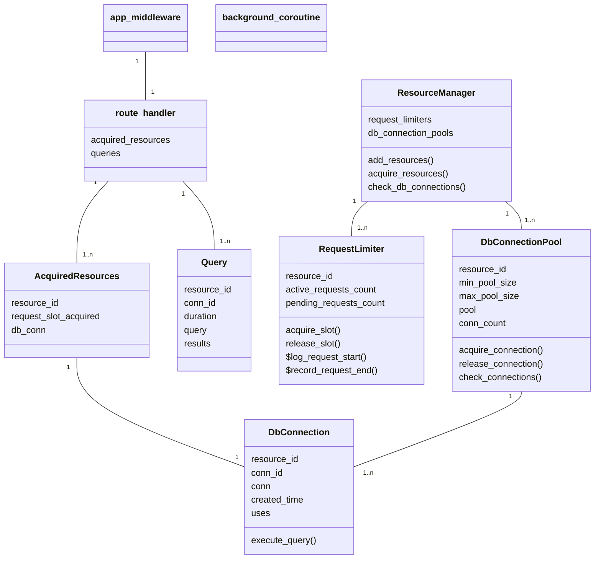

- [Overview / project goals](#overview--project-goals)
  - [Possible use cases for this project](#possible-use-cases-for-this-project)
- [Quick start](#quick-start)
- [URLs](#urls)
- [Screenshots](#screenshots)
- [Architecture](#architecture)
  - [Watchtower Components](#watchtower-components)
  - [Flow](#flow)
- [Design](#design)
  - [Database Resources](#database-resources)
  - [Preventing deadlocks with design constraints](#preventing-deadlocks-with-design-constraints)
  - [Sizing database pools](#sizing-database-pools)
  - [Incoming connections, tasks and denial-of-service considerations](#incoming-connections-tasks-and-denial-of-service-considerations)
  - [Periodically creating new resources](#periodically-creating-new-resources)
  - [FastAPI middleware vs dependencies](#fastapi-middleware-vs-dependencies)
  - [Data Models](#data-models)
  - [Configs](#configs)
  - [Application Logs & Logging Strategy](#application-logs--logging-strategy)
  - [Exception Strategy](#exception-strategy)
  - [Misc Design Notes](#misc-design-notes)
- [Metrics pipleline](#metrics-pipleline)
  - [Watchtower Metrics](#watchtower-metrics)
  - [Promethesus summaries](#promethesus-summaries)
  - [Prometheus with FastAPI and Gunicorn](#prometheus-with-fastapi-and-gunicorn)
  - [Prometheus UI](#prometheus-ui)
  - [Grafana metrics dashboards](#grafana-metrics-dashboards)
- [Logs pipeline](#logs-pipeline)
  - [rsyslog](#rsyslog)
  - [journald](#journald)
  - [Fluent Bit](#fluent-bit)
    - [Input, Filtering and Parsing](#input-filtering-and-parsing)
    - [Output](#output)
  - [Viewing log records stored in O2 with Grafana](#viewing-log-records-stored-in-o2-with-grafana)
  - [Viewing log records stored in Loki with Grafana](#viewing-log-records-stored-in-loki-with-grafana)
  - [Viewing log records stored in O2 with O2](#viewing-log-records-stored-in-o2-with-o2)
  - [Visualizing log data stored in O2 with Grafana](#visualizing-log-data-stored-in-o2-with-grafana)
  - [Visualizing log data stored in Loki with Grafana](#visualizing-log-data-stored-in-loki-with-grafana)
- [Traces](#traces)
- [Alerts](#alerts)
  - [Viewing alerts with Grafana](#viewing-alerts-with-grafana)
  - [Viewing alerts with OpenObserve](#viewing-alerts-with-openobserve)
- [OpenObserve Notes](#openobserve-notes)
- [Files, Directories, Retentions](#files-directories-retentions)
- [Possible future enhancements/features](#possible-future-enhancementsfeatures)
- [Dev env](#dev-env)
- [TBD](#tbd)

# Overview / project goals
WatchTower is a containerized database/query middleware/API service with the following features:
- acts like a front door to multiple databases 
  - request throttling per "database resource"
  - connection pooling per database resource, with no possiblity of deadlocks
- optimal use of asyncio, threads and multiprocessing for database queries
- timeouts to ensure that no operation runs too long or hangs: request timeouts, database
  connection timeouts, per-query timeouts
- sufficient/curated metrics for monitoring, tuning and debugging
- configurable levels of logging details
- runtime config value changes/overrides

Tech stack
- docker compose
- rsyslog or journald
- Fluent Bit
- Python asyncio, FastAPI, Uvicorn, Gunicorn
- Prometheus: client library and server
- AlertManager
- Loki or OpenObserve (O2)
- Grafana

## Possible use cases for this project
- you want to see an example of a non-trival application using the above-mentioned tech stack
- you want to see how to instrument a Python application with Prometheus metrics
  and then create Grafana dashboards based on those metrics
  - you want detailed metrics about database activity
- you wan to see how to implement a full logging pipeline
- you want to abstract the underlying database(s) (more) from the API implementation code
- you want database connection pooling
- you want to limit/control/throttle how many active connections there are to a database,
  a table, or a set of tables in a database
- you want faster database interactions but still use Python--i.e., you want to take advantage
  of asyncio rather than spin up dozens of non-asyncio gunicorn workers and/or threads

# Quick start
To start the watchtower application along with fluent bit, openobserve, prometheus server, loki and grafana:
```
$ sudo scripts/setup
$ docker compose up
```
Go to [http://localhost:5080/web/ingestion/custom/logs/fluentbit](http://localhost:5080/web/ingestion/custom/logs/fluentbit)
and set the value of O2_TOKEN in file `.env` to the value shown next to `HTTP_Password`.

Go to http://localhost:3000/connections/datasources, click "add new datasource"
then scroll or type openobserve to find the plugin.  Click on it.
Enter `http://openobserve:5080` for the URL, enable Basic Auth, enter the
O2 user and password (from file `.env`) for the basic auth details.
Click "save and test".

Restart the stack:
```
$ docker compose down
$ docker compose up
```
If all went well, everything should start up and services should be able to connect to each other.

Go to http://localhost:8000/docs and run some queries.<br>
Go to http://localhost:3000/dashboards and view the watchtower metrics dashboards.<br>
Go to http://localhost:5080/web/logs and view the watchtower logs.

# URLs
- http://localhost:8000/docs  - watchtower FastAPI Swagger UI
- http://localhost:8000/redoc - watchtower FastAPI ReDoc
- http://localhost:3000 - Grafana
  - http://localhost:3000/dashboards - Grafana dashboards
  - http://localhost:3000/drilldown - Grafana drilldown,  for viewing metrics and logs
  - http://localhost:3000/explore - Grafana explore, the older interface for viewing metrics and logs
  - http://localhost:3000/alerts - Grafana alerts
- http://localhost:5080 - OpenObserve (O2)
  - http://localhost:5080/web/dashboards - O2 dashboards
  - http://localhost:5080/web/metrics - O2 metrics
  - http://localhost:5080/web/logs - O2 logs
  - http://localhost:5080/web/alerts - O2 alerts
- http://localhost:9093 - AlertManager
- http://localhost:9090 - Prometheus UI, mainly used for debugging
- http://localhost:3100 - [Loki API](https://grafana.com/docs/loki/latest/reference/loki-http-api/),
  unlike the other URLs in this section, this one is not a website

# Screenshots
See [screenshots](screenshots).

# Architecture
WatchTower, Prometheus server, Fluent Bit, Loki, O2 and Grafana each run in their own container.

```mermaid
architecture-beta
    group wt
    service watchtower(mdi:tower-fire)[WatchTower] in wt
    group clients[clients]
    service client1(mdi:account-box)[client n] in clients
    service clientN(cloud)[client 1] in clients
    group mv[metrics logging tracing visualization]
    service rsyslog(mdi:text-box-outline)[rsyslog or journald] in mv
    service fluentbit(logos:docker-icon)[Fluent Bit] in mv
    service prometheus(logos:prometheus)[Prometheus] in mv
    service grafana(logos:grafana)[Grafana] in mv
    service loki(logos:docker-icon)[Loki or O2] in mv
    client1:R -- L:watchtower
    clientN:R -- T:watchtower
    watchtower:R -- L:db1
    watchtower:R -- L:dbN
    prometheus:T -- B:watchtower
    grafana:R -- L:loki
    fluentbit:R -- B:loki
    grafana:L --  R:prometheus
    rsyslog:R -- L:fluentbit
    group dbs[datastores]
    service db1(logos:mysql)[DB resource 1] in dbs
    service dbN(logos:postgresql)[DB resource n] in dbs
```


## Watchtower Components
The WatchTower Python application consists of various classes and some key functions--e.g.,
FastAPI middleware, lifespan (background task) and route handling functions.


background_coroutine is defined as a FastAPI lifespan function--i.e., it "runs in the
background" as an asyncio task that is separate from the route handling tasks.
This function periodically calls check_connections() on the ResourceManager and
applies override configs if it detects that signal SIGUSR1 was received.

app_middleware is defined as a FastAPI middleware function.
It creates the correlation ID, writes logs about the overall request and
adds http response headers.

route_handler represents a route handler function.
The handler for a client request acquires resources and hence obtains one or more
AcquiredResources objects from the ResourceManager.  Each AcquiredResources object has a DbConnection.
The handler also creates one or more Query objects, which are then used to execute queries using
the DbConnection of the AcquiredResources object.  (In the future, these Query objects may get
added to a QueryCache.)

DbConnection represents a subclass of ABC (abstract base class) BaseDbConnection--e.g.,
OdbcConnection is a subclass. BaseDbConnection and its child classes are not shown to keep
the diagram smaller. (This is not a class diagram.)

The RequestLimiter limits/throttles how many client requests can access a particular database
resource simultaneously.

DbConnectionPool manages a pool of connections for a single database, a single table, or
a set of tables in a single database, depending on how you define each "database resource"
(see section Database Resources below).

## Flow
- A client sends an http request to the application.
- If using Gunicorn, it receives the request and passes it to a uvicorn worker.
  Otherwise, uvicorn receives the request.
- Uvicorn creates an asyncio task and adds it to the set of tasks the asyncio run loop manages.
- When that task is scheduled to run, it calls app_middleware().
- app_middleware() creates a correlation ID and puts that into a context variable.
  If the route is not for metrics or docs, call_next() is called, which
  ends up calling the appropriate route function.
- The route function 
  - calls acquire_resources() to obtain request (slot) and database connection resources
    (via dependency injection)
    - this method also stores the resource acquisition durations in a context variable
  - creates Query objects which are then used to query the database(s) using the acquired connections
  - performs whatever logic is appropriate on the returned data, generates
    the results and returns them
- Because of the yield statement in acquire_resources(), all acquired resources are freed.
- Because of the yield statement in app_middleware(), response headers are added.
- An http reply is sent to the client.
 
TBD discuss authentication, authorization and metrics collection.

# Design

## Database Resources
Central to the design is the concept of a "database resource". 
A database resource can represent a database, a table, or a set of tables in a single database.
Each resource has a resource_id, a DbConnectionPool and a RequestLimiter.
The RequestLimiter is used to prevent deadlocks (see next section) and monitor how many
active and pending requests exist for the resource.
The DbConnectionPool is used to limit the number of active database connections for
the resource and of course to provide faster access to the database by having already-established
connections available for use.

A client request must successfully acquire all of the resources it needs to satisfy the
entire request before processing/querying will begin.
FastAPI's [dependency injection](https://fastapi.tiangolo.com/tutorial/dependencies/)
system is used to hook into the flow to ensure each route acquires all needed dependencies,
including these request resources and database connections.

Each resource has its own set of configs related to how many active and pending requests are
allowed, min and max pool size, and various timeouts related to acquiring resources and
running queries. I.e., you can (and should) independently tune each resource.

## Preventing deadlocks with design constraints
When using a pool of resources with async operations, it is imperative to design the application
to avoid deadlocks--i.e., avoid the possibility where a pool becomes empty and all active requests are
waiting to get additional resources from the pool. The following design constraints are implemented
to avoid the possibility of such a deadlock:
- a max of R requests can be active per resource
  - more than R requests can be pending per resource
- a max of R (configurable) database connections can be in the pool for that resource
- each active client request can only acquire up to one database connection from the resource's
  DbConnectionPool
- as an added safeguard, all acquisitions use timeouts

This has the disadvantage that a single request can only run one query at a time against each
resource/database. A possible future enhancement could maybe allow a single request to run multiple
queries in parallel as follows (untested logic below):
- a request can try to acquire up to X (configurable) connections from the pool with
  a short timeout
- if Y connections are obtained, and Y > 1, increase the pool size by Y-1 until the request
  is finished
- if only 1 connection is obtained, then run the queries serially
- if no connections are obtained, try to get a connection the normal way with a larger timeout,
  then run the qureies serially
In addition, there needs to be some limit for how large the pool can grow.

If you know the max number of concurrent queries of all requests, the following,
less complex, logic should work: set the pool size to at least R * (C - 1) + 1,
where R is the max number of active requests and C is the max number of concurrent connections
of any/all requests.

## Sizing database pools
There are metrics and alerts that can help you determine appropriate pool sizes--i.e., how
to set the min_conn_pool_size, max_conn_pool_size and max_pending_requests config values:
* wt_pool_empty_total, wt_pool_exhausted_total
* ConnectionAcquireTimeouts, HighConnectionAcquisitionTime, ConnectionPoolEmpty,
  ConnectionPoolExhausted, LowConnectionUtilization

## Incoming connections, tasks and denial-of-service considerations
https://github.com/encode/uvicorn/discussions/1959:
"Uvicorn workers simply accept as fast as they can, creating an internal queue of async tasks
inside each worker process, waiting to be run on the event loop".
As noted in the discussion, Uvicorn has a `--limit-concurrency` option to limit the number of
concurrent requests that it will accept. Once this limit is reached, uvicorn returns a HTTP 503
response to incoming requests. But this option is not supported under gunicorn, which is the
target production deloyment environment for this project.
Even if the limit-concurrency option were supported under gunicorn, this project would want to
collect metrics for these overload scenarios.

Config `<resource_id>__max_pending_requests` is used to specify how many
requests can be pending before the application (not Uvicorn) starts returning HTTP 503
responses to incoming requests. This value should be set in conjuction with
`<resource_id>__request_slot_timeout`. E.g., maybe it is okay for 100 requests to be pending if
normally 100 active requests will typically finish within the slot_timeout period.

Since this project does not limit Uvicorn from creating a new task for each incoming
request, it may not be suitable for certain applicationse that must guard against
high volume denial-of-service attacks. For those applications having something in front
of this project to rate-limit incoming requests may be required.

## Periodically creating new resources
It seems to be common practice (likely because of buggy software) to handle only _x_ number of
requests before stopping a worker or closing a DB connection. This project follows
that common practice.

Uvicorn options `--max-requests` and `--max-requests-jitter` are used to specify how many requests,
with a jitter, a worker handles before stopping.

Configs `<resource_id>__db_conn_max_uses` and `<resource_id>__db_conn_max_age` are used
to specify how many uses/queries and how long a connection remains open before closing.
A background task attempts to keep a minumum number of connections open.

Each DbConnectionPool has a background asyncio task that waits for an item to be added
to the add_conn_queue.
Whenever a new connection is needed, this queue must be used to ensure that no more than
`<resource_id>__db_max_conn_pool_size` connections exist.

## FastAPI middleware vs dependencies
Middleware is used for things that need to be applied to all (or most) client requests
and responses. Hence app_middleware() is used for the following in this application:
- creating a correlation ID
- saving the time the request arrived (for logging a request duration later)
- logging details about each request and response
- adding headers to the response

Dependencies are used for things that are route-specific or apply to a set of routes.
Hence dependencies are used for the following in this application:
- limit requests for database resources
- acquire (and later release) database connections
- authorization

## Data Models
None of the routes specify a Pydantic model for the return type
(see [Response Model - Return Type](https://fastapi.tiangolo.com/tutorial/response-model/)).
If you want this middleware application to perform data validation on the data received
from the database, you may want to add Pydantic models. I would think most uses of this
project would have the client(s) of this application perform data validation, to keep
the middleware layer less coupled to the data.

## Configs
Having the ability to override config values at runtime in a production environment is a very
useful feature, hence this application supports that.

Override configs are stored in /opt/overrides/watchtower.cfg, as defined by docker
compose environment variable OVERRIDE_CONFIG_PATH.

Sending the container a SIGUSR1 signal will cause it to re-read the main/bundled config file
and any override config file:
```
$ docker kill -s SIGUSR1 <container id>
```
This signal is unfortunately ignored if the uvicorn `--reload` option is used, which is typically
used when developing. So if you want to test this feature, adjust the `command:` line in
docker-compose.yml to either remove that option or run the application with gunicorn.

Some config values cannot be overridden at runtime, meaning that if you override them and
send the container a SIGUSR1, the new/overridden values will be ignored.
Such configs are clearly documented as such.

For security reasons, some configs--e.g., the path to a database--can never be
overridden, even with a restart of the workers or the entire application. These configs
are placed in a `[secure]` section in the main config file.

To support runtime overrides, the python code must must always obtain config values by lookup.
E.g., use `config.get()` or one of its variants to obtain a config value.
Do not lookup a config value and store it as a property on a long-lived object.

When using gunicorn, you can also send the container a SIGHUP signal. This will cause all
workers to restart, so this, more-disruptive action is a way to get all new/overridden values
to be applied, even those marked as not supporting runtime overrides.

## Application Logs & Logging Strategy
Some classes purposely do not log anything or have very few, mostly debug logs. Higher
level classes with more application context perform most logging.
The following have no or very few logs:
- BaseDbConnection and its subclasses
- DbConnectionPool
- RequestLimiter
- route handler functions (at least not in the sample routes provided)

There are a number of configs that can be set to control how much information is logged
about queries as well as request slot and database connection acquisition durations.

Most logs include the correlation ID, which is stored in a
[ContextVar](https://docs.python.org/3.12/library/contextvars.html).

## Exception Strategy
- Custom exceptions inherit from base custom exception AppError.
  - Custom exception DatabaseError is used to capture low-level database error details.
    The client will receive a 503 or 500 status code, as appropriate.
  - Custom exception AppTimeoutError is used for relaying timeouts.
    The client will receive a 504 status code.
  - Custom exception ResourceError is used when there are too many pending requests
    for a DB resource.
    The client will receive either a 429 status code.
  - Custom exception WithDetailsError is used for unexpected errors/exceptions.
    The client will normally receive a 500 status code.
- ValueError is used for invalid function arguments/values.
- RuntimeError is used for logic errors and indicate a program bug.
- Exception is used for unexpected problems. 
  The client will normally receive a 500 status code.
- FastAPI.HTTPException is used to return an http error status code to the client.
  Before raising this exception the code normally logs a more detailed error.
  Only the following raise this exception: 
  - route handlers
  - ResourceManager.acquire_resources() since it is a dependency injection function
  - Query.run() to remove repetitive code from the route handlers
- asyncio.CancelledError is used if the program is shutting down.
  The client will receive a 503 status code.

## Misc Design Notes
If you have control over all clients and the middleware layer, you might consider using
something more efficient than https--e.g., [gRPC](https://grpc.io/docs/).

Because Python does not support true parallel execution of CPU-bound tasks, if your
use case requires that, you will likely be better off using another language for
your database middleware layer, such as golang.

If a query returns a lot of data/rows, and the route handler needs to do a non-trivial
amount of processing/computation on that data, you should periodically call
`await asyncio.sleep(0)` to yield control back to the event loop to allow other tasks
to run.

# Metrics pipleline
The watchtower application is instrumented with Prometheus client library calls.
Prometheus server is used to scrape the metrics.  `prometheus.yaml` is et to
scrape metrics every 30 seconds, and evaluate recording and alerting rules every
minute.

You can use Prometheus server or O2 for long term metric storage, hence the following
pipelines are supported:
- watchtower, prometheus client library -> Prometheus server [-> O2]

When using O2 for long term storage, Prometheus server is still required to
perform the metrics scraping and then forwarding to O2. 
The retention for prometheus server is set lower when using O2--to 12 hours.

Grafana can be used to visualize the metrics.
When using O2 for long term storage, O2 can also be used to visualize the metrics.

O2 also [exposes metrics](https://openobserve.ai/docs/expose-metrics/) that can
be scraped if desired. This project does not scrape O2 metrics.

## Watchtower Metrics
See also the Grafana -> Metrics section below.

The [prometheus python client library](https://prometheus.github.io/client_python/) is
used to instrument the code with a curated set of metrics.
You will likely want to change these metrics somewhat to suit your particular
needs. If you are new to prometheus, one of the main issues people often run into is 
[overusing labels](https://prometheus.io/docs/practices/instrumentation/#do-not-overuse-labels),
so I suggest reading about that before adding any additional labels.

If you have a lot of URL paths you may not want to collect metrics "per URL".

Durations include failures, hence full timeout periods will likely be included in the
duration values, skewing the metics longer. If failures were excluded then it would be 
difficult to notice high latency caused by many slow, but failing, requests/operations.

For metrics with status codes, to make it easier to initialize the metric children,
only status codes '2xx', '4xx' and '5xx' are used as labels. If you need more granularity than
that, you could add a few specific ones or you can examine the logs.

Request metrics:
- requests per URL path (counter, wt_requests_total)
  <br>If you have a limited number of clients--e.g., only a fixed number of other services
  will be clients--you may want to count requests per client (as addition to or instead of
  per path), or maybe have a separate "requests per client" metric.
  These metrics can be used to generate topN information--e.g., topN URL paths.
  Request errors per URL path can be calculated using metric wt_request_duration_seconds_count
  and selecting labels with status codes >= 400 (see below).
- pending     requests per resource ID (gauge-livesum, wt_pending_requests)
- in progress requests per resource ID (gauge-livesum, wt_in_progress_requests)
- last time a request was received per resource ID (gauge-mostrecent, wt_last_request_time_seconds)
- durations to service a request per URL path (histogram, wt_request_duration_seconds)
  - this metric, since it is a histogram also includes _count and _sum metrics
- durations to service a request per URL path and per status code (summary, 
  wt_request_duration_summary_seconds)
  - query for '2xx' status codes for success counts/rates
  - query for '4xx' and/or '5xx' status codes for error/failure counts/rates

Response metrics:
- last time a response was sent per resource ID (gauge-mostrecent, wt_last_response_time_seconds)

Resource metrics:
- requests per resource ID (counter, wt_resource_requests_total)
- last time a request was received per resource ID (see above: wt_last_request_time_seconds)
- errors acquiring a request slot per resource ID and per error type (counter, wt_request_slot_errors_total)
  - error type is overload or timeout 
- durations to acquire a request slot per resource ID (histogram, wt_request_slot_acquire_duration_seconds)
- Database connection pool metrics and connection metrics: 
  - created connections (counter, wt_created_connections_total)
  - closed connections  (counter, wt_closed_connections_total)
  - pool empty per resource ID (counter, wt_pool_empty_total)
    - since the pool can expand and contract, this metric can help determine it the
      db_min_conn_pool_size should be increased
  - pool exhausted per resource ID (counter, wt_pool_exhausted_total)
    - an exhausted pool means that db_max_conn_pool_size connections are in use and
      hence this metric can help determine if that value should be increased
  - connection creation errors per resource ID and per error type (counter, wt_conn_creation_errors_total)
    - error type is timeout or other
  - open connections per resource ID (gauge-livesum, wt_open_connections)
  - connections in the pool per resource ID (gauge-livesum, wt_pooled_connections)
    - wt_open_connections - wt_pooled_connections = connections that are in-use
  - last time a connection was successfully created per resource ID (gauge-mostrecent,
    wt_last_conn_created_time_seconds)
  - last time a new connection could not be created per resource ID (gauge-mostrecent,
    wt_last_conn_created_error_time_seconds)
  - durations to acquire a database connection per resource ID (histogram,
    wt_acquire_connection_duration_seconds)
  - durations of connection usage per resource ID (histogram, wt_connection_usage_duration_seconds)
    - e.g., if a request requires that two queries be executed for one resource ID,
      the sum of the durations for the two queries will be recorded as a single
      duration usage observation for this metric

Query metrics:
- queries per resource ID (counter, wt_queries_total)
- failed queries per resource ID and per failure type (counter, wt_query_errors_total)
  - failure type is timeout or other
- query durations per resource ID (histogram, wt_query_duration_seconds)
- rows returned (per query) per resource ID (histogram, wt_query_rows)
  - does not include streaming responses

By capturing the request rates, error rates and latencies 
for requests/responses, resource IDs and queries
we satisfy the RED method for monitoring--i.e., Rate, Errors, Duration.

Container process metrics:
- CPU usage per pid, percentage (gauge-liveall, wt_cpu_usage)
- memory usage (rss, vms, shared) per pid, bytes and percentage (gauge-liveall,
  wt_mem_rss_bytes, wt_mem_vms_bytes, wt_mem_percent)
- open file descripters per pid (gauge-liveall, wt_open_fds)
- I/O per pid, bytes sent and bytes received (counter, wt_io_read_bytes_total, wt_io_write_bytes_total)

If you are using WSL2, ensure that option "Use the WSL 2 based engine" is off, otherwise
the container process metrics will not be accurate.

See also misc/cAdvisor.sh which will run [cAdvisor](https://github.com/google/cadvisor)
in a docker container. It exposes a web UI at http://localhost:8080 and a boatload of
metrics at http://localhost:8080/metrics. I felt this was too heavy for the project so
I used Python module psutil to have the application expose its own process metrics
instead.

Possible future metrics:
- TopN queries. Unless your application only has a small set of fixed queries,
  prometheus likely can't be used for this. It will require custom code. E.g.,
  add a dictionary of query text -> count to the Query object and update the
  dictionary using an asyncio lock.
  If there are a lot of different queries, this could be expensive to store.
  Maybe only enable collection for a configurable amount of time for a particular
  resource ID. Maybe only index the first n characters of the sql query.
  The TopN query results would be written to a special file per gunicorn pid.
  For many applications, TopN URL paths is probably sufficient. TopN queries
  would be useful if, say, many requests run multiple queries or a particular
  set of queries are executed by many requests. In general, if you really need 
  to know which specific queries are the heavy hitters, then implement custom
  code for this.
- Query cache metrics:
  - cache requests (counter)
  - cache misses (counter)
  - cache failures (counter)
  - cached queries (gauge, livesum)
  - durations to get cached results (histogram)
  - durations to get cache miss results (histogram)

## Promethesus summaries
The [summary metric type](https://prometheus.github.io/client_python/instrumenting/summary/) 
in the prometheus python client library does not store or expose quantile information as
of this writing. They provide only a sum and a count of observed events, but they are cheap to
generate, collect and store. The sum and count can be used to calculate averages and rates.
However, since they do not provide quantile information, they can't be used to
understand the distribution of the metric values, which is often important when evaluating
the end-user experience. Since histograms also have _sum and _count metrics like
summaries, this project uses mostly histograms instead of summaries.

An early version of this project (before it was in git) defined a histogram to capture
the duration of each request by endpoint and status code. After looking at the metrics
that were generated, it seemed that collecting histograms for 4xx and 5xx status codes
was overkill, so a summary was introduced for this.

## Prometheus with FastAPI and Gunicorn
Since this project uses gunicorn with multiple workers/processes, we need to configure
prometheus to use [multiprocess mode](http://prometheus.github.io/client_python/multiprocess/)
which causes the prometheus client to write metrics to disk (mmap).
Those metrics are then served via a prometheus ASGI application, as described here:
[FastAPI and Gunicorn](https://prometheus.github.io/client_python/exporting/http/fastapi-gunicorn/).

In multiprocess mode, gauge metrics must specify a mode.

## Prometheus UI
The Prometheus UI is available at http://localhost:9090.
Grafana is used to chart the various Watchtower metrics, but the Prometheus UI
is useful for the following:
* checking the status of the Watchtower "target"--i.e., to determine if the Prometheus server
  is having any issues scraping Watchtower's metrics page at http://watchtower:8000/metrics.
  Note that "watchtower" in that URL resolves using docker's embedded DNS server when
  using docker compose, since by default docker compose creates a user-defined/custom network
  for the services defined in the compose file.
  You can view the metrics page from your browser at http://localhost:8000/metrics.
* running queries in the [expression browser](https://prometheus.io/docs/visualization/browser/),
  useful for running debugging ac-hoc PromQL queries.

## Grafana metrics dashboards
- see also [Grafana support for Prometheus](https://prometheus.io/docs/visualization/grafana/)
- see also the Watchtower Metrics section above

Watchtower comes with 3 Grafana metrics dashboards. Unless noted otherwise, visualizations are time series.
1. main
   - requests per URL and per resource ID
   - request durations (heatmap)
   - last request and last response per resource ID (absolute and relative times)
   - responses by status codes: 2xx, 4xx, and 5xx
   - pending requests and in progress requests by resource ID (gauge and time series)
   - memory usage, CPU usage, open file descriptors and I/O stats by pid (gauges and time series)
2. by selected endpoint
   - requests and requests per second
   - request durations: heatmap, 50th and 95th percentiles, average
3. by selected resource ID
   - requests
   - last request and last response (absolute and relative timess)
   - pending and in progress requests (gauge and time series)
   - request slot acquire durations for all resource IDs and for the selected resource ID (heatmaps)
   - request slot acquire errors for the selected resource ID and by error type (overload or timeout)
   - open and pooled database connections (gauge and time series)
   - pool empty and pool exhausted
   - database connections created and closed
   - database connection creation errors
   - last database connection created and last connection error (absolute and relative times)
   - database connection acquire durations for all resource IDs and for the selected resource ID (heatmaps)
   - database connection acquire timeout errors
   - database connection usage durations: heatmap, 50th and 95th percentiles, average
   - queries
   - query errors by error type (other or timeout)
   - query durations: heatmap, 50th and 95th percentiles, average
   - query rows: heatmap, 50th and 95th percentiles, average

Some charts exist on more than one dashboard.

The main dashboard provides a high-level overview.
The "by endpoint" dashboard is useful to drill-down to the endpoint level, which is useful
if you suspect a problem with one or more endpoints or to discover that there is a problem
with one or more endpoints.
The "by resource" dashboard is useful to drill-down to the database/resource ID level and
hence is useful for examining resource allocation, database pool sizes, database connections,
database query performance and problems at this level.

Dashboards 2 and 3 each define a
[Grafana query variable](https://grafana.com/docs/grafana/latest/dashboards/variables/)
to enable selection of the endpoint or resource ID.

Most metric visualizations use Grafana's
[`__rate_interval` variable](https://grafana.com/blog/2020/09/28/new-in-grafana-7.2-__rate_interval-for-prometheus-rate-queries-that-just-work/?form=MG0AV3)
which causes Grafana to automatically determine the appropriate range for a rate calculation. 
This helps ensure that the range used in the rate query is at least four times the scrape interval,
which is a best practice for accurate rate calculations.

# Logs pipeline
This project supports various logging pipelines:
- rsyslog or journald -> fluent bit -> OpenObserve and/or Loki 

When sending logs to O2, O2 and/or Grafana can be used to view the logs stored in O2.<br>
When sending logs to Loki, Grafana must be used to view the logs stored in Loki.

docker-compose.yml uses all components except journald.<br>
docker-compose-journald.yaml uses all components except rsyslog.
<br>Normally you will only want to send logs to O2 or Loki, not both, so you'll likely
want to edit the docker compose file to suit your log storage preference.

Both files have all services set to log level WARN
except for the watchtower service, which is set to level INFO.

When using Loki for log storage, Grafana's simplified
[logs drilldown](https://grafana.com/docs/grafana/latest/explore/simplified-exploration/logs/)
app can be used.

When using OpenObserve (O2) for log storage, logs can be queried and visualized with O2 and/or Grafana.
If using Grafana, only the [explore](https://grafana.com/docs/grafana/latest/explore/)
app can be used to view logs, and an OpenObserve plugin must be installed.

The watchtower application (i.e., logging.py) writes logs with key-value pairs
(rather than JSON) for human-readability.
E.g., a watchtower log contains app-specific key-value pairs such as
```
tag=query-stats msg="some info about the query" resource_id=sqlite_traffic query_duration=2.5
```
A tag and a msg field are included in every watchtower log.
If you are using Loki, the tag field will become a Loki label to allow quick querying for specific tags.

Depending on which docker compose file you use, it will configure the watchtower service to
use either the [syslog logging driver](https://docs.docker.com/engine/logging/drivers/syslog/)
or the [journald logging driver](https://docs.docker.com/engine/logging/drivers/journald/).
The other containers use whatever default logging driver docker is configured to use.

Container logs are not written directly to fluent bit. You may want to change this.
For systems I work on (which are typically on-prem), if something goes wrong with some
component of the logging pipeline, it is useful to have the logs on local disk.

## rsyslog
See the instructions in [rsyslog/30-watchtower.conf](rsyslog/30-watchtower.conf)
for how to install the rsyslog config file and restart rsyslog.
If you ran scripts/setup, this should have already been done.

When sending watchtower logs to rsyslog, the watchtower service is configured to use the
logging driver's tag option, which sets the APP-NAME and MSGID in rsyslog logs to
`watchtower/<container_id>`.

Tail watchtower logs generated by rsyslog as follows:
```
$ tail -f /var/log/watchtower/watchtower.log
```

You'll likely want to use logrotate to rotate logfile /var/log/watchtower/watchtower.log.

## journald
When sending watchtower logs to journald, the watchtower service is configured to use the
logging driver's tag option, which sets the CONTAINER_TAG and SYSLOG_IDENTIFIER in journald
logs to `watchtower`.

Here's what the journald MESSAGE field looks like for a watchtower containter log:
```
$ journalctl CONTAINER_TAG=watchtower -o verbose| grep MESSAGE| tail -10
    MESSAGE=[10] DEBUG db_connection_pool.py:145 tag=dbconn-req msg="about to create a new DB connection" resource_id=mysql_traffic
```
Tail journald for watchtower logs as follows:
```
$ journalctl CONTAINER_TAG=watchtower -f [-o verbose]
```
I was surprised and disappointed to discover that as of 2025-03 the docker journald logging
driver has no way to pass the log level as metadata, hence the reason it is included in
the MESSAGE.

Fluent bit receives 27 (!) fields from journald, which I find excessive/wasteful.
Does anyone care to see _CMDLINE and _EXE for every log message? I doubt it.

I originally started this project using journald, then I switched to rsyslog, but
I retained support for journald.

## Fluent Bit
### Input, Filtering and Parsing
To view what Fluent Bit receives from rsyslog or journald, modify a docker compose
file to use the appropriate fluent-bit-*-debug.yaml config file, then run just
watchtower and fluent bit:
```
docker compose -f <modified compose file> watchtower fluent-bit
```

For rsyslog, Fluent Bit is configured to perform the following:
- tail `/var/log/watchtower/watchtower.log`
- extract the host, application timestamp, service, container_id, pid, level and file:line_no
  from the beginning of the `log` field via a regex,
  then extract the key=value pairs from the end of the field via the logfmt parser
  - the application timestamp is used as the time_key since this is the earliest timestamp

For journald, Fluent Bit is configured to perform the following:
- extract the watchtower service (only) logs from journald:
  <br>`systemd_filter: CONTAINER_TAG=watchtower`
- extract the host, application timestamp, service and container_id from journald fields
  - the application timestamp (SYSLOG_TIMESTAMP) is used as the time_key since
    this is the earliest timestamp
- extract the pid, level and file:line_no from the beginning of the `MESSAGE` field via a regex,
  then extract the key=value pairs from the end of the field via the logfmt parser

Logs that are not generated by watchtower application's logging.py (e.g., uvicorn logs)
are parsed in a separate fluent bit "modify" filter.

A lua script is used to parse traceback fields and replace `|` characters with
newlines so that tracebacks are easier to read in O2 and Grafana. 🎉

The parsed log information is then sent to Loki or O2.

Key=value pairs in the log messages can be parsed by fluent bit, or later by
LogQL (Loki's query language) or SQL in O2.
This project parses them in fluent bit hence they are top-level fields
which simplifies the creation of Grafana and O2 Visualize panels,
avoiding the need to use logfmt() in every query.

### Output
When fluent bit sends data to O2, things are pretty straightforward--the
[http output plugin](https://docs.fluentbit.io/manual/pipeline/outputs/http)
is used to send JSON records to O2. The easiest way to view these records is to query
them in [O2's Log Search](https://openobserve.ai/docs/user-guide/logs/log-search/).
Click the "Logs" icon near the top left of the O2 website,
then in the "select stream" dropdown select watchtower_logs,
then click the green "Run query" button. You should see the raw JSON logs.

You could also use [O2's search api](https://openobserve.ai/docs/api/search/search/).

Things are trickier with Loki:
- the [Loki output plugin](https://docs.fluentbit.io/manual/pipeline/outputs/loki)
  seems to add some undocumented fields to the records
- you can (and will want to) specify certain fields to be Loki labels that Loki
  will then index for faster query response times
- you can send records in json or logfmt format to Loki

For Loki, Fluent Bit performs the following additional processing:
- specifies the service_name and tag fields as
  [Loki labels](https://grafana.com/docs/loki/latest/get-started/labels/)
- specifies the host, container_id, pid, and file as
  [structured metadata](https://grafana.com/docs/loki/latest/get-started/labels/structured-metadata/)

For more information about interfacing fluent bit with Loki, see [docs/loki.md](docs/loki.md).

I found an annoying limitation with LogQL/Loki: there is no way to plot values from logs
without using an aggregation function. E.g., if a watchtower log has `query_duration=4.23`
there is no way to plot such values over time with LogQL directly.
I originally started this project with Loki, then I switched to O2 because of this limitation.
With O2, custom SQL can be used to extract the value, cast it to a float, and plot the
values over time directly. O2 can even use a timestamp field other than the log timestamp
for the x-axis on a time-series plot.

You can also use a tool like tcpdump to see the records that fluent bit outputs.

## View/query log records stored in O2 with O2
To view/query logs stored in O2 with O2, go to [localhost:5080/web/logs](localhost:5080/web/logs).
From the "Select Stream" dropdown, select watchtower_logs,
then click the green "Run query" button. This shows the complete log messages.

Often the most important fields to view are the level, tag and msg fields.
Hover over each in the field list and click their eye icons to only view those fields.
You can reorder the fields by dragging a column header. A view can be saved and
later recalled using the "Saved View" button at the top of the screen.

To filter by a specific tag value, hover over a tag in a record, then click the
equal or not equal icon, as appropriate.
Click anywhere on the log message or on the ">" to see the full log.

Logs can also be queried with SQL.

See also https://openobserve.ai/docs/user-guide/logs/log-search/.

## View/query log records stored in O2 with Grafana
To view logs stored in O2 with Grafana, a plugin is required:
[grafana plugin](https://openobserve.ai/docs/operator-guide/grafana_plugin/).
This plugin should have already been installed/untarred into /opt/grafana-plugins
if you ran the scripts/setup script.
The "Quick start" section above describes how to add O2 as a Grafana datasource.

To to Grafana's Explore app: http://localhost:3000/explore and select OpenObserve
from the datasource picker.

Click the "Run query" button (cycle icon) near the top right.
So view just the level, tag and msg fields, click the Table button then
select the fields from the list.

To filter by a specific tag value, hover over a tag in a record, then click the
plus or minus search icon, as appropriate.
To see the full log from the table view a bit cumbersome: add the Content field
then hover over a content value and click the eye icon to view the full log
in a popup.

Logs can also be queried with SQL.

The "Logs volume" histogram does not appear to work.

## View/query log records stored in Loki with Grafana
Loki should already be configured as a datasource due to config file
grafana/provisioning/datasources/loki.yaml, which was created after following
these instructions: https://grafana.com/docs/grafana/latest/datasources/loki/.

To view logs stored in Loki with Grafana, use the newer Logs Drilldown:
http://localhost:3000/a/grafana-lokiexplore-app/explore.
(See also https://grafana.com/docs/grafana/latest/explore/simplified-exploration/logs/.)
You should see a watchtower service graph and some raw logs.
Click the "Show logs" button to explore the logs for the watchtower service.
I typically like to view only the level, tag and msg fields in table view:
1) click the Table button
2) click Manage columns and unselect Line and select detected_level (not level),
then tag, then msg.

To view the full log, click the eye icon. 
To filter by a specific tag value, click a tag in a record, then click the plus
or minus as appropriate.

To view a breakdown of the values of any label or field (e.g., detected_level) click
Labels or Fields (as appropriate) then click the Select button.

Logs can also be queried with LogQL using the Exlpore app: http://localhost:3000/explore.

For more information about exploring Loki logs in Grafana, see
https://grafana.com/docs/grafana/latest/explore/simplified-exploration/logs/get-started/


## Visualizing log data stored in O2 with O2
You can cast field values to integers or floats and plot them.
E.g., you can plot request durations from log records with tag request-stats.
Here's a sample log message:
```
INFO middleware.py:106 tag=request-stats msg="GET /sqlite-psv results" client=172.18.0.1 queries=1 status_code=200 content_length=- duration=0.002 cid=9408a5016521
```
Here's how to plot that data:
- click the O2 Dashboards icon, then "New Dashboard", then add a panel
- at the bottom of the chart, click "Custom SQL" and enter this query:
  ```sql
  SELECT _timestamp as time, CAST(duration AS FLOAT) as "req duration" FROM "watchtower_logs" WHERE tag='request-stats' ORDER BY time ASC
  ```
- click the Apply button

TBD show a query using the histogram function and time-aggregated.

See also [docs/o2-sql.md](docs/o2-sql.md) for some more complicated SQL queries that plot
data using a timestamp other than the log record timestamp.

## Visualizing log data stored in O2 with Grafana
I haven't determined if it is possible to plot/chart data extracted from log records using Grafana.
If a new dashboard is created in Grafana with openobserve set as the datasource, the default query is
```sql
select histogram(_timestamp) AS x_axis_1, count(*) AS y_axis_1 from "watchtower_logs" GROUP BY x_axis_1 ORDER BY x_axis_1
```
which works, but it isn't really interesting. 

The query shown in the previous section doesn't work in Grafana, nor does this one:
```sql
select histogram(_timestamp) AS x_axis_1, avg(cast(duration as float)) AS y_axis_1 from "watchtower_logs" where tag='request-stats' GROUP BY x_axis_1 ORDER BY x_axis_1
```

## Visualizing log data stored in Loki with Grafana
LogQL has an annoying quirk that to plot raw values in a Grafana time series panel requires the
use of aggregation, unlike, say how Kibana Lens with Elasticsearch worka or O2 with SQL works.

TBD show some samples
```
sum_over_time({service_name="watchtower", tag="request-stats"}|logfmt | keep duration| unwrap duration [$__auto])
```

# Traces
For this small project, [Tempo](https://grafana.com/oss/tempo/) seemed a bit heavy
so I opted to log tracebacks as logs with level `ERROR`, `tag=traceback` and
`traceback=<traceback contents here>`.

As discussed above, newlines in the `traceback` field are replaced with '|' characters and then
fluent bit is configured to restore the newlines.

To view traces stored in O2 with O2, enter `tag = 'traceback'` in the query editor box, then
type Ctrl-Enter or click the "Run query" button. Click the anywhere on the log record or the '>' and
the traceback field value should appear with line breaks.

To view traces stored in O2 with Grafana, enable SQL Mode and enter the following SQL query:
```sql
SELECT * FROM "watchtower_logs" where tag='traceback'
```
then type Ctrl-Enter or click the "Run query" button. In Table view, ensure the traceback field
is selected. Hover over a traceback in a log record and click the eye/inspect icon to view
the traceback in a popup with newlines. This is the only way I've found to get Grafana to show
newlines as line breaks.

To view traces stored in Loki with Grafana, use the Logs Drilldown and filter by
label tag=traceback. Click the eye icon for a log record and the traceback field
value should appear in a popup with line breaks.

TBD traceback screenshots

# Alerts
File app/conf/prometheus_alert_rules.yml defines the alerts generated by this project.
Each alert has a comment that indicates what the cause of the alert could be.
Alerts can use metric labels to look for specific conditions. E.g., see HighEndpointErrorRate
and LowConnectionUtilizationSqliteTraffic.

## Viewing alerts with Grafana
Grafana Home -> Alerting -> Alert Rules will show all of the alerts and it will indicate
which ones are pending or firing. While that is useful, alerts should normally be
sent someplace to get someone's attention. This is where the 
[Alertmanager](https://prometheus.io/docs/alerting/latest/alertmanager/) comes in.
It is part of the docker compose file and the web UI is available at http://localhost:9093.
(See also the Alerts tab in the Prometheus web UI, which can be useful for debugging
alert generation.)

The alertmanager.yml configuration file just has one example (with placeholders for
some of the config values) of routing alerts to email. Sending alerts to an email
group is not ideal if no one on the receiving end is responsible--i.e., "fire and hope"
that someone reads the email and acts on it is probably not going to work too well.
Important alerts should maybe go to a ticketing system.
Since where to send alerts is very company-specific, it is outside the scope of this project.

I recommend learning more about Alertmanager, which provides "a controllable pipeline"
for managing alerts. E.g., inhibition, silencing, routing, grouping, throttling, etc.

# Alerts and OpenObserve
O2's Alerts page is designed for alerts generated and managed within O2 itself (using
its own rules and log/metric queries).
Prometheus alerts, by default, are not automatically sent to or displayed in OpenObserve's
Alerts UI. Although Prometheus alerts could be sent to O2 and ingested as logs,
this seems like too much effort. I recommend using Alertmanager's or Grafana's UI to view
Prometheus alerts. The other option is to forward Promtheus metrics to O2 and
create O2 alert rules directly on those metrics.

# OpenObserve Notes
O2 can run as a single instance or in HA mode on a cluster: 
[O2 architecture](https://openobserve.ai/docs/architecture/).
Since this project's storage needs are very modest, it uses a single instance of O2 with
local disk storage. You should consider using object storage if you have that available.

O2 offers a plethora of
[configuration options](https://openobserve.ai/docs/environment-variables/).

O2 can consume a lot of available memory.
See https://github.com/openobserve/openobserve/discussions/2711 for some tips about
tuning memory usage lower if desired. This project does tune a number of items lower.

# Files, Directories, Retentions
Look at [scripts/setup](scripts/setup) to see which directories are used by the project.

- Loki logs are retained for 30 days, see services/loki/loki.yaml.
- Prometheus logs are retained for only 12 hours, since this project is setup such
  that O2 is used for long term log storage. See docker-compose.yml.
- The O2 default retention is 10 years. See https://openobserve.ai/docs/environment-variables
  env variable ZO_COMPACT_DATA_RETENTION_DAYS.

# Possible future enhancements/features
A database middleware layer like Watchtower can always be enhanced to add more functionality/features.
Here are some ideas:
- caching of query results for frequent queries. TBD use redis?
  - ability to view cache stats/metrics
  - ability to clear the cache at runtime; TBD per query?
- retry queries up to x times; this may need to be database specific because retries should
  only be performed for certain types of DB errors
- request throttling per client or API key or ... 
- finer-grain connection pools: e.g., based on different users or groups of users
- log throttling: throttle or aggregate failure logs; e.g., suppose a database is down but
  thousands of requests keep coming in for it
- DB connection closing: currently only a few specific errors are checked for to determine when
  to keep a DB connection open after an error, so more work could be done here
- add podman support or switch over to podman--i.e., k8s yaml files suitable for use with podman play

# Dev env
Build a "base" image with the necessary libraries and modules:
```
$ docker build -f Dockerfile.base -t watchtower-base .
```
Note that this base image does not include the application code.

Run docker compose to develop with uvicorn:
```
$ docker compose up
```
The application code is bind mounted inside the container.
Because the compose file uses the `--reload` uvicorn option, after saving a python file
modification the app should automatically reload.

To test ODBC connectivity, start mariadb and adminer in another terminal:
```
$ sudo mkdir -p /opt/db/mariadb-data
$ sudo chown -R 999:999 /opt/db/mariadb-data
$ sudo chmod -R 755 /opt/db/mariadb-data
$ docker compose -f docker-compose-mysql.yml down  # in case you didn't do this after a previous run
$ docker compose -f docker-compose-mysql.yml up
```
Then create a database, a table and populate the table:
```
$ docker compose run --rm watchtower python3 /opt/app/scripts/create-mysql-data.py
```
Adminer website: http://http://localhost:8080

So that vscode can properly lint the Python code, I install modules on the host as well:
```
$ pip3.11 install aiomysql
```

# TBD
Things I should be adding to the project:
- O2 and Grafana log visualizations
- O2 and Prometheus 
  - Prometheus metrics dashboards?
- more documentation, esp. for O2 and Grafana
- change log_level to INFO for github commit

Things I might add to the project:
- healthchecks
  - build a fluent bit docker image with wget and enable http server for fluent bit
- write a load test program in preparation for the next item:
- better sample database tables--maybe use stock prices, include sqlite.db and export mysql
- add more to loki.md
  - add example LogQL commands to filter by watchtower, tag, resource_id
  - create charts related to processing from logs
    - add metric-like logs?
- production deployment notes
- youtube video explaining the project
- query caching
- authentication? Maybe leave this out since it is often dependent on where the application runs.
  - maybe at least mention running an nginx proxy in front of the websites
- authorization?  Maybe leave this out also, or show how to use an API token on at least one route.
- https
